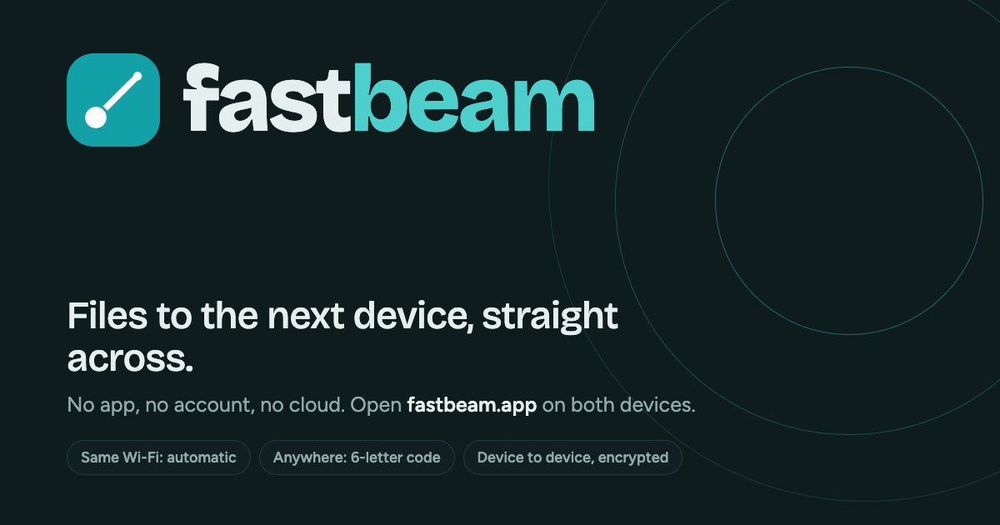

<p align="center">
  <a href="https://fastbeam.app"></a>
</p>

<h1 align="center">fastbeam</h1>

<p align="center">
  <strong>Files to the next device, straight across.</strong><br>
  No app, no account, no cloud. Open <a href="https://fastbeam.app">fastbeam.app</a> on both devices.
</p>

<p align="center">
  <a href="https://fastbeam.app">Open fastbeam</a> ·
  <a href="#how-it-works">How it works</a> ·
  <a href="#privacy">Privacy</a> ·
  <a href="#browser-support">Browser support</a> ·
  <a href="#develop">Develop</a> ·
  <a href="https://github.com/theanam/fastbeam/issues">Report a problem</a>
</p>

<p align="center">
  
</p>

---

fastbeam is a web page that moves files and text between two browsers directly, the way AirDrop or LocalSend do, but with nothing to install and nothing in the middle. It is a static site on GitHub Pages. There is no server that ever sees your files: every byte travels over an encrypted WebRTC connection from one device to the other.

- **Same Wi‑Fi: automatic.** Open the page on two devices on the same network and they appear on each other's screens within seconds.
- **Anywhere else: a six‑letter code.** One device shows a code, a QR and a link; the other scans, types or taps it. Optionally lock the code with a password.
- **Any size.** Files stream in 64 KB chunks with backpressure and land on disk as they arrive, so multi‑gigabyte transfers work without filling memory.
- **Installable.** Add it to your home screen or dock, it opens offline, and on Android it shows up in the system share sheet.

## Using it

1. Open **https://fastbeam.app** on both devices. Each picks a friendly name like *Brave Otter*; tap the name to change it.
2. **Same network:** tap the other device's tile, choose photos, files or a folder, or type some text, and press Send. The other side sees who is sending, what, and a six‑digit verification code that should match on both screens. It accepts, and the transfer runs.
3. **Different networks:** tap *Show my code* on one device and *Scan or enter* on the other. Scan the QR, type the six characters (case does not matter, O/0 and I/1/L are never used), paste the link, or just open the link. The devices connect and the sending step is the same as above.
4. **Password:** on the *Show my code* tab, switch on *Protect with a password*. fastbeam suggests two words such as `otter-pancake`; say them out loud to the other person. Someone who has the code but not the password cannot connect, and the check is tied to the actual connection so a relay in the middle cannot pass it either.
5. **Receiving:** on desktop Chrome you choose where to save. On Chrome for Android and Firefox the file streams into Downloads. On Safari and iPhone it lands in private storage and a Save button hands it over. Photos and videos open in a built‑in viewer.
6. **Sending to your own devices:** after the first accepted transfer from a device, you can switch on *Auto‑accept* for the rest of the session so you stop confirming each one.

## How it works

```
 ┌──────────────┐   room id + SDP (via public Nostr relays)   ┌──────────────┐
 │  Device A    │ ◄────────────────────────────────────────► │  Device B    │
 │  (browser)   │                                             │  (browser)   │
 │              │ ◄══════════ WebRTC data channel ══════════► │              │
 └──────────────┘        every byte, DTLS‑encrypted           └──────────────┘
         ▲                                                           ▲
         └───────────── STUN: "what is my public address?" ──────────┘
```

**Finding each other on the same network.** Each device asks a STUN server for its public address. Devices behind the same router get the same answer, so fastbeam hashes that address (with the IPv6 /64 prefix as a second key) into a room name and joins that room on a set of public Nostr relays. Anyone else in the room is on your network. Relays only ever see the hash and the connection details, never an address in the clear and never a file.

**Pairing across networks.** A six‑character code (alphabet `ABCDEFGHJKMNPQRSTUVWXYZ23456789`) is hashed into a private room name the same way. The QR and the link carry only the code, in the URL fragment, so it never reaches any web server. Codes expire after ten minutes and are single‑use: once a device has paired through a code, a fresh one replaces it and the old link is refused.

**Connecting.** The relays carry the WebRTC offer and answer, then drop out. The browsers connect directly using STUN to discover their public addresses. There is no TURN relay by design: when two networks will not allow a direct path, fastbeam says so plainly and suggests the fix that always works, putting both devices on one Wi‑Fi or a phone hotspot. A small network check on the home screen (*Direct OK*, *Limited*, *Same Wi‑Fi only*) predicts this up front.

**Transferring.** A dedicated data channel carries small JSON control messages (offer, accept, progress, cancel, done) and binary frames of up to 64 KB, each tagged with a file index. The sender reads files as a stream and pauses when the channel's buffer fills; the receiver acknowledges every megabyte written, which also bounds how far the sender may run ahead. Both sides compute a six‑digit verification code from the two DTLS certificate fingerprints, so matching codes rule out anything sitting between the devices.

**Receiving to disk.** The receiver picks the first path its browser supports: the File System Access API (Chromium desktop) writing straight to a file you choose; a stream through fastbeam's own service worker, which the browser saves as a normal download (Chrome for Android, Firefox); the Origin Private File System written from a worker, handing back a disk‑backed file to save (Safari, iPhone); and, last resort, an in‑memory Blob.

**Passwords.** The password never leaves the device. Both sides derive a key with PBKDF2‑SHA‑256 (600,000 iterations, salted with the code) and HKDF, then exchange HMACs over fresh nonces and both connection fingerprints. The host allows one attempt every two seconds and five failures per code before rotating it. Known limit, also stated in the app: a relay that deliberately fails the check could then guess a weak password offline, so pick a password you would not mind being guessed, or pair on the same Wi‑Fi.

**Staying connected.** Phones drop their Wi‑Fi radio to sleep all the time. fastbeam treats a brief disconnect as a blip rather than a goodbye: it requests an ICE restart in the background, shows the device as *Reconnecting…* while keeping its details, and only removes it after a long silence. Open sheets and dialogs stay put.

## Privacy

- Files and text go device to device, encrypted with DTLS. No server, including GitHub Pages, ever receives them.
- To find each other, devices post a hashed network id and WebRTC connection details (which include IP addresses) to public Nostr relays. Devices you connect to can see your public IP address, as with any direct connection.
- Device names are random animal names, editable, and are the only identity there is. No accounts.
- The deployed site at fastbeam.app counts page views with Google Analytics. The tag is injected by the deploy workflow, so it is not in this source tree and local or forked builds have no analytics at all.
- Everything in *Settings → What leaves this device* says the same in plain words inside the app.

## Browser support

| Browser | Discover and send | Receive |
| --- | --- | --- |
| Chrome / Edge on desktop | Yes | Save to a location you pick |
| Chrome on Android | Yes | Streams to Downloads |
| Firefox on desktop and Android | Yes | Streams to Downloads |
| Safari on macOS | Yes | Private storage, then Save |
| Safari on iPhone and iPad | Yes, keep the tab in front | Private storage, then Save |

The share target (sending files from other apps into fastbeam) works on Android when fastbeam is installed to the home screen.

## Develop

```sh
npm install
npm run dev          # http://localhost:5179
npm run check        # typecheck + unit tests + production build
npm run e2e          # Playwright against the dev server (uses your local Chrome; needs internet)
```

Pushing to `main` builds and deploys to GitHub Pages. The e2e suite includes two‑tab tests that discover each other through the real relays and move files, plus a password‑pairing scenario. For a live view of what the app is doing, open the status console from the terminal icon in the header (desktop) or from *Settings → Troubleshooting*; *Copy diagnostics* produces a pasteable report for bug reports.

Stack: Vite, Preact with signals, TypeScript, [Trystero](https://github.com/dmotz/trystero) for signaling over Nostr, Workbox for the service worker, `qrcode` and `jsQR` for QR codes, Vitest and Playwright for tests.

```
src/
  net/        STUN probe, room ids, signaling adapter, peer link, discovery, pairing, password auth
  transfer/   protocol, sender, receiver, sinks (File System Access, service worker, OPFS, Blob)
  state/      signals: identity, settings, peers, logs, UI
  ui/         components, sheets and screens
  sw.ts       service worker: offline shell, streamed downloads, Android share target
```

## Feedback

Found a bug or have an idea? [Open an issue](https://github.com/theanam/fastbeam/issues). For anything else, email **anam.ahmed.a@gmail.com**. If a transfer misbehaves, *Settings → Troubleshooting → Copy diagnostics* and paste the result into the report; it contains the recent event log and your device details, never your files.
